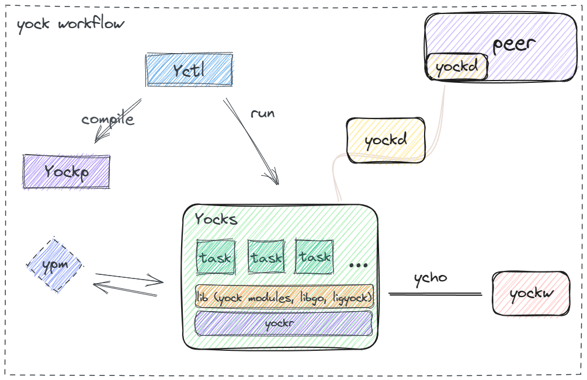

#  Yock

[](https://goreportcard.com/report/github.com/ansurfen/yock)

[](https://pkg.go.dev/github.com/ansurfen/yock)

English | [简体中文](./docs/zh_cn/README.md)

Yock is a solution of cross platform to compose distributed build stream. It's able to act as software package tool, like Homebrew, rpm, winget and so on. It also is used for dependency manager (pip, npm, maven, etc.) of programming languages. On top of this, yock also implements distributed build tasks based on grpc and goroutines (and can even build cluster for this). You can think of it as the lua version of the nodejs framework, except that it focuses on composition and is more lightweight.

## Architecture


* Yctl: it's used for scheduling yock's commands.
* YockPack: it's mainly used for preprocessing lua file, such as schema decomposition, decomposing a lua source file into multiple lua files according to a given modes for distributed system.
* YockScheduler: the scheduler is responsible for running the lua code, and launchs goroutines to execute in tasks.
* YPM: yock package manager, used for completion and loading dependencies.

## Installation

You can download the binary version here, or try the following two methods.
`NOTE`: After downloading, you must mount yock to the local environment, and need to manually run the depoly script in the compressed package to use it.

#### Build by yock

Yock implements something like "bootstrap", meaning it's able to build itself. Of course, the prerequisite for all this also requires go compiler.

The first, to fetch source code of yock
```cmd
git clone https://github.com/Ansurfen/yock.git
```

Execute the go command and schedule the yock build script to build yock
```cmd
cd ctl
./build.bat ffi
```

#### Embed in Go

Install yock library (yock supports >= Go1.20)
```cmd
go get "github.com/ansurfen/yock"
```

yockr: A lua interpreter based on the `gopher-lua` package, which is easier to get started.
```go
import yockr "github.com/ansurfen/yock/runtime"

func main() {
	r := yockr.New()
	if err := r.Eval(`print("Hello World")`); err != nil {
		panic(err)
	}
}
```

yockc: Provides yock with a series of simple GNU commands such as echo, rm, ls, etc. You can call them directly, and the specific Opt field can be found in `docs/yockc`
```go
import yockc "github.com/ansurfen/yock/cmd"

func main() {
	yockc.HTTP(yockc.HttpOpt{
		Method: "GET",
		Save:   true,
		Debug:  true,
		Dir:    ".",
		FilenameHandle: func(s string) string {
			return s
		},
	}, []string{"https://www.github.com"})
}
```

yocks: A scheduler based on the yockr, which is the core of yock. Yocks not only includes interpreters and standard libraries, but also simple goroutine pools to facilitate the scheduling of asynchronous tasks. In addition, yocks is also equipped with protobuf based on the yocki protocol to implement cross-language calling services.
```go
import (
	"log"

	"github.com/ansurfen/yock/scheduler"
)

func main() {
	ys := yocks.New()
	lib := ys.CreateLib("log")
	lib.SetField(map[string]any{
		"Info": func(msg string) {
			log.Println(msg)
		},
		"Infof": func(msg string, a ...any) {
			log.Printf(msg, a...)
		},
	})
	if err := ys.Eval(`log.Info("Hello World!")`); err != nil {
		panic(err)
	}
}
```

yocku: Provides basic functions such as crypto, ssh, random and so on for yock. The following is an example of a weight-based load balancer implemented by the util package.
```go
import (
	"fmt"

	"github.com/ansurfen/yock/util"
)

func main() {
	testset := map[string]int{
		"apple": 0,
		"banana": 0,
		"coconut": 0,
	}
	elements := []string{}
	for k := range testset {
		elements = append(elements, k)
	}
	lb := util.NewWeightedRandom(elements)
	for i := 0; i < 100; i++ {
		e, idx := lb.Next()
		testset[e]++
		lb.Up(idx)
	}
	fmt.Println(testset, lb.Weights())
}
```

yocke: Out-of-the-box configuration file module that creates environment in directories with quick. In addition, yocke also provides manipulation of environment variables and abstractions of registry(windows) and plist(darwin). You can see the details under `docs/yocke`.
```go
import (
	"fmt"

	yocke "github.com/ansurfen/yock/env"
)

type YockeTestConf struct {
	Author  string `yaml:"author"`
	Version string `yaml:"version"`
}

func main() {
	// defer yocke.FreeEnv[YockeTestConf]()
	yocke.InitEnv(&yocke.EnvOpt[YockeTestConf]{
		Workdir: ".yocke",
		Subdirs: []string{"tmp", "log", "mnt", "unmnt"},
		Conf:    YockeTestConf{},
	})
	env := yocke.GetEnv[YockeTestConf]()
	defer env.Save()
	env.SetValue("author", "a")
	fmt.Println(env.Viper())
}
```

ycho: yock's log module implements zlog (supports log splitting) based on `zap` and tlog (tui log) based on `bubbletea` and so on.
```go
import "github.com/ansurfen/yock/ycho"

func init() {
	zlog, err := ycho.NewZLog(ycho.YchoOpt{
		Stdout: true,
	})
	if err != nil {
		panic(err)
	}
	ycho.SetYcho(zlog)
}

func main() {
	ycho.Info("Hello World!")
	ycho.Fatalf("1 == 2 -> %v", 1 == 2)
}
```

yockf: Based on the [libffi](https://github.com/libffi/libffi) encapsulated foreign function interface, you can easily call dynamic libraries in Go.
```go
import (
	"fmt"

	"github.com/ansurfen/yock/ffi"
)

func main() {
	mylib, err := ffi.NewLibray("libmylib.dll")
	if err != nil {
		panic(err)
	}
	hello := mylib.Func("hello", "void", []string{})
	hello()
	hello2 := mylib.Func("hello2", "str", []string{"str", "int"})
	fmt.Println(hello2("ansurfen", int32(60)))
}
```

## Document

You can find information about module development and yock development [here](/docs/).

## Center Repository

If you want to register a module to yock so that it can use an identifier index instead of URL, see here.

## TODO

- [ ] implement mock service and compose middlewares (YockCloud)
- [ ] implement preprocess and DSL to enhance lua syntax

## License

This software is licensed under the MIT license, see [LICENSE](./LICENSE) for more information.