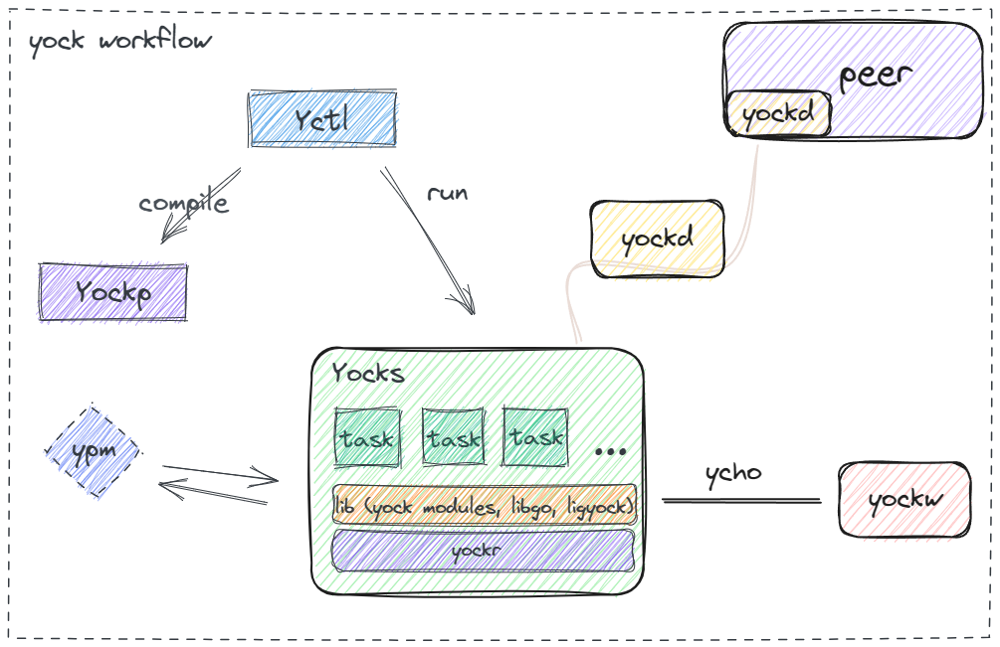

#  Yock

[](https://goreportcard.com/report/github.com/ansurfen/yock)

[](https://pkg.go.dev/github.com/ansurfen/yock)

[English](../../README.md) | 简体中文

Yock 是一个跨平台的分布式构建流编排解决方案。它能够作为软件包使用，就像Homebrew, rpm, winget等等。同时它还能充当编程语言的依赖管理的角色（pip，npm，maven等等）。在此基础上，yock还基于grpc和协程实现分布式构建任务（甚至可以为此搭建集群）。你可以将他视作nodejs框架的lua语言版本，不同的是他专注于编排，更加轻量。

## 架构


* Yctl: 负责调度yock的命令。
* YockPack: 主要用于对lua文件的预处理，例如模式分解，将一份lua代码根据给定的模式分解成多份lua文件供分布式运行。
* YockScheduler: 调度器负责运行lua代码，以task为单位起协程执行。
* YPM: yock包管理，负责补全和装载依赖。

## 安装

你能够在这里下载二进制版本，或者尝试以下两种方式。
`注意`: 下载完后还需要将yock挂载到本地环境中，你需要手动运行压缩包内的depoly脚本去完成这个过程。

#### 使用yock构建

Yock实现了类似"自举"的操作，这意味着它能够自己构建自己。当然，这一切的前提还需要go语言的编译器。

首先，获取yock的源代码
```cmd
git clone https://github.com/Ansurfen/yock.git
```

执行go命令，调度yock构建脚本去构建yock
```cmd
yock> cd ctl
yock/ctl> go run . run ../auto/build.lua -a
```

#### 嵌入Go语言

首先，通过go mod去获取库
```cmd
go get "github.com/ansurfen/yock"
```

接着，在你的项目中引入库使用它
```go
package main

import . "github.com/ansurfen/yock/cmd"

func main() {
	HTTP(HttpOpt{
		Method: "GET",
		Save:   true,
		Debug:  true,
		Dir:    ".",
		Filename: func(s string) string {
			return s
		},
	}, []string{"https://www.github.com"})    
}
```

## 文档

你可以在这里查看关于模块开发以及yock开发相关的信息。

## 中央仓库

如果你想要将模块登记到yock，以便他能够使用标识符索引取代url，可以看这里。

## 未来计划

- [ ] 实现MOCK服务以及中间件编排（YockCloud）
- [ ] 实现预处理以及dsl增强lua语法

## 协议

这个软件被构建在MIT协议之下，详情请查看 [LICENSE](../../LICENSE) 。